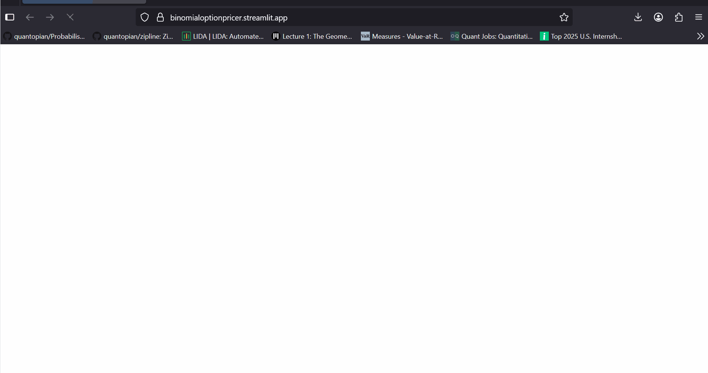

# 📈 BinomialOptionPricer

A data-driven model for evaluating financial **option contracts** using binomial tree methods and **live market data**.

This app provides a step-by-step walkthrough of European and American option pricing based on the **binomial model**, integrating real-time inputs and an intuitive interface.

---



---

## 🚀 Features

- 🧮 **Binomial Tree Option Pricing**: Supports European options (calls & puts)
- 📊 **Dynamic Market Inputs**: Fetches real-time stock data from Yahoo Finance
- ⚙️ **Custom Parameters**: Define number of steps, risk-free rate, and option-type
- 🧠 **Fully Explainable**: Transparent logic with no black-box modeling
- 📈 **Streamlit UI**: Clean, interactive interface to explore option valuations

---

## 🌐 Live App

> [🔗 Launch on Streamlit Cloud](https://binomialoptionpricer.streamlit.app)

---

## 🛠️ Tech Stack

- **Language**: Python
- **Libraries**: NumPy, Pandas, yfinance, Streamlit
- **Model**: Binomial Option Pricing (Cox-Ross-Rubinstein formulation)
- **Visualization**: Streamlit widgets and interactive result tables

---

## 🗂️ Project Structure

| File               | Description                                 |
|--------------------|---------------------------------------------|
| `app.py`           | Streamlit app interface                     |
| `binomial.py`      | Core binomial pricing engine                |
| `exceptions.py`    | Custom exceptions for input validation      |
| `sp500.json`       | Stock ticker mapping (S&P 500)              |
| `requirements.txt` | Required Python dependencies                |
| `LICENSE`          | MIT License                                 |
| `binomial_option_price_model.gif` | UI Demo GIF used in README  |

---

## 📌 Example Use Case

Want to estimate the fair price of a **European call option on AAPL** expiring in 30 days with a strike price of $180?

This tool lets you plug in all relevant inputs and instantly get the **fair option value** using a discretized binomial tree.

---

## 💡 Why Use This

- ✅ No reliance on external APIs beyond Yahoo Finance
- ✅ Helps visualize how tree depth, volatility, and expiration affect option value
- ✅ Built for learning, experimentation, and rapid prototyping

---

## 🧪 How to Run Locally

1. Clone the repository:
```bash
git clone https://github.com/<MunjPatel>/BinomialOptionPricer.git
cd BinomialOptionPricer
```

2. Install dependencies:
```bash
pip install -r requirements.txt
```

3. Launch the app:
```bash
streamlit run app.py
```

---

## 🧠 Project Highlights

- Designed for **financial clarity** and transparency — ideal for students, researchers, or interview prep  
- Provides **fast experimentation** without complex installations or proprietary APIs

---

## 📜 License

This project is licensed under the [MIT License](LICENSE).
